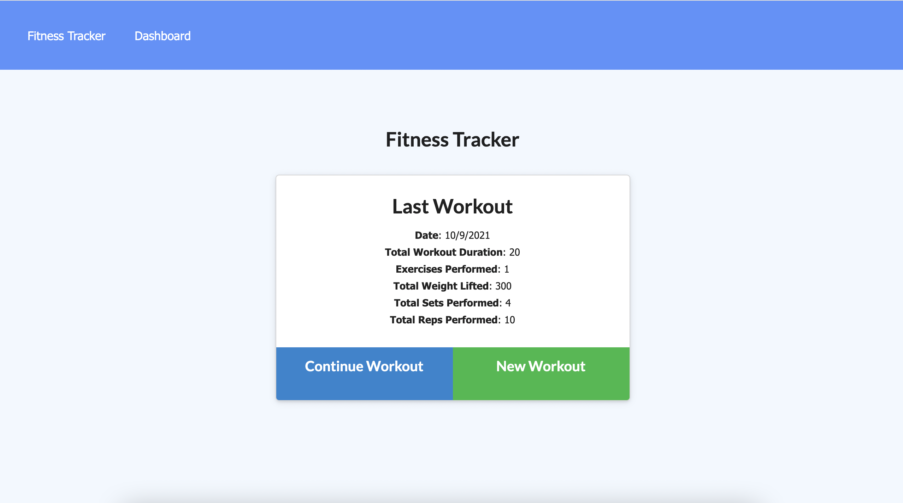
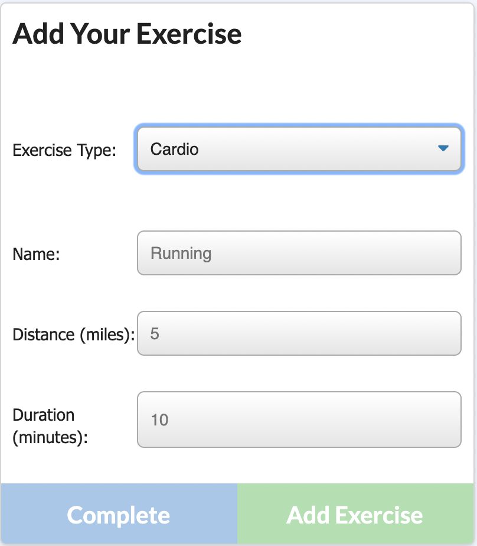
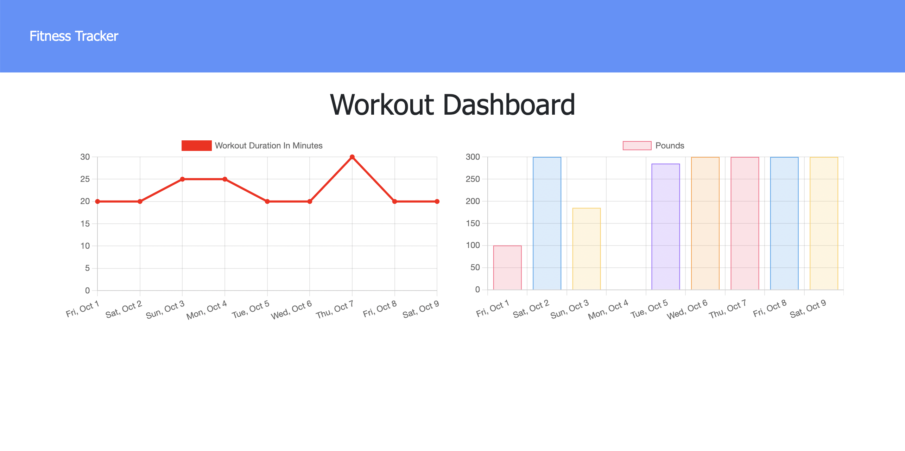

# workout-tracker

## An MVC-Structured Full Stack Web Application utilizing MongoDB and a dynamic UI so users can track their workout goals

## User Story

As a user with a fitness goal in mind, I want an accessible tool for logging my workouts so that I may track my progress.

## Features

Using the Workout Tracker app, users can add multiple exercises within one workout throughout the day by simply clicking 'add exercise' .. once the user has completed their exercise, they make click 'end workout' & all of the exercises added will be included for that particular 'workout'. This data is then rendered to the graph in the dashboard so the user can track their progress. The user has the option to add a cardio OR resistence exercise each time they make a contribution. 
 
This application gives the user an easy-to-use & aesthetically-pleasing UI that allows them to track their exercises & save the information to a personal database. With a background in preventive health, I am extremely passionate about encouraging a healthy & active lifestyle. Most people do not stick to lifestyle changes if they do not have a clearly defined goal & are unable to keep track of their progress. Since we live with ourselves every day, we are unable to see the small changes we are making on a daily basis. However, if we are able to compare ourselves to last week, we will find motivation & inspiration to commit to our change.  
 
I hope this application gives people the tools necessary to gift themselves with a more positive daily habit & will help them achieve their health goals. 

## Table of Contents
  - [Installation](#installation)
  - [Languages](#languages-and-technologies-used)
  - [Questions](#questions)
  - [Contributors](#contributors)
  - [License](#license)
  - [Author](#author-notes)
  - [Screenshots](#application-screenshots)

## Installation

### Deployed Application

To visit the deployed application, you may do so HERE : https://dry-wildwood-23805.herokuapp.com/?id=616381e327b46d001698ab01

### Clone Repository

git clone git@github.com:lyndseyjw/workout-tracker.git

### Install Dependencies

All NPM packages required for this application are listed as dependencies in the package.json file. Run "npm i" in your terminal at the root directory to install all packages. Ensure you have Node.js installed on your machine. You must also create a .env file to store your DB name, user and password information. The application is invoked using 'npm run start' in the command line.

### Start Application

Once you see 'app is now running on Port 3000', you can view the app on http://localhost:3000/

## Languages and Technologies Used

HTML, CSS, Javascript, Node, NPMs, Express, MongoDB, Mongoose, Heroku

## Questions

You may visit my Github at : https://github.com/lyndseyjw OR email lyndseyjwatson@gmail.com if you have any questions.

## Contributors

Lyndsey Watson

## License

This project is licensed under the terms of the MIT license. 

## Author Notes

This workout tracker was created to test my new knowledge of MongoDB. Previously working with MySQL & Sequelize, I created this app to challenge my skills with the more popular database of MongoDB & Mongoose. Still using RESTful APIs through Express, I was able to create this application & deploy to Heroku in no time at all! MySQL & Sequelize helped me understand the format & syntax of databases while MongoDB & Mongoose made me appreciate the simplicity of their methods. I will be using their databases moving forward in my future projects.

## Application Screenshots

Fitness Tracker Homepage :

Add a Resistance Exercise

Add a Cardio Exercise

Dashboard Exercise Tracker

