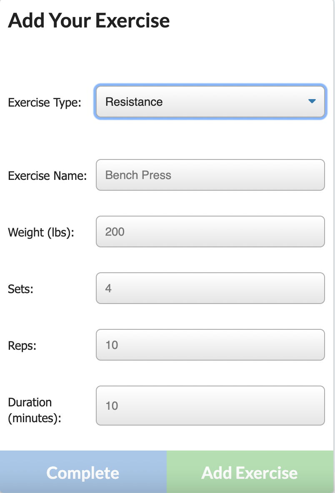

# workout-tracker

## A MongoDB Workout Tracker with Dynamic UI

This workout tracker was created to test my new knowledge of MongoDB. Previously working with MySQL & Sequelize, I created this app to test out my skills at the more popular database of MongoDB & Mongoose. Still using routes through Express, I was able to create this application & deploy to Heroku in no time at all! MySQL & Sequelize helped me understand the format & syntax of databases while MongoDB & Mongoose made me appreciate the simplicity of their methods. I will be using their databases moving forward in my future projects.

This application gives the user an easy-to-use & aesthetically-pleasing UI that allows them to track their exercises & save to a database. With a background in preventive health, I am extremely passionate about encouraging a healthy & active lifestyle. Most people do not stick to lifestyle changes if they do not have a clearly defined goal & are unable to keep track of their progress. Since we live with ourselves every day, we are unable to see the small changes we are making on a daily basis. However, if we are able to compare ourselves to last week, we will find motivation & inspiration to commit to our change. 

I hope this application gives people the tools necessary to gift themselves with a more positive daily habit & will help them achieve their health goals. 

This project is licensed under the terms of the MIT license. You may contact the sole contributor at lyndseyjwatson@gmail.com if you have any questions.

Technology used : HTML, CSS, Javascript, Node, NPMs, Express, MongoDB, Mongoose, Heroku

To visit the deployed application, you may do so HERE : https://dry-wildwood-23805.herokuapp.com/?id=616381e327b46d001698ab01

I hope you enjoy!

Fitness Tracker Homepage :

Add a Resistance Exercise

Add a Cardio Exercise

Dashboard Exercise Tracker
